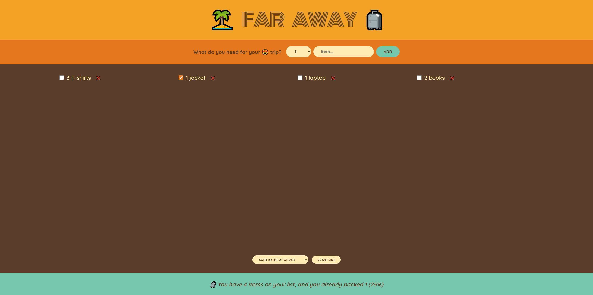

# Far Away 🧳

**Far Away** is a React application designed to help you organize and manage your travel packing list. Add, toggle, and remove items to ensure you’re ready for your next adventure!

## Features

- Add items with quantity and description
- Mark items as "packed" to track progress
- Delete items from the list as needed
- Clear the entire list with a single click
- Real-time statistics on packed items
- User-friendly and responsive design

## Demo

Check out the live version:

[https://far-away-nu-five.vercel.app/](https://far-away-nu-five.vercel.app/)

## Technologies Used

- **React** – for building UI components and managing state
- **CSS** – for styling and responsive design

## Installation

To run this project locally, follow these steps:

1. Clone this repository:
   `git clone https://github.com/MilotaiEduard/Far-Away.git`

2. Navigate to the project folder:
   `cd Far-Away`
3. Install dependencies:
   `npm install`
4. Start the development server:
   `npm start`

The application will open on `http://localhost:3000`.

## Project Structure

- `/src`: Contains the main components and logic for handling list operations.
- `/public`: Stores static assets like images.
